# **任务四实验报告**  
---  
## 一. 背景  
在任务三中，已经搭建并训练好了一个MLP模型和一个VGG13模型，对CIFAR-10数据集进行图像分类任务，并且取得一些成果。  
## 二. 实验目的  
基于任务三中的MLP模型和VGG13模型进行策略优化和结构优化。  
在验证集准确率、Loss曲线以及参数量和计算量上取得平衡，得到一个相对最优的模型。
## 三. MLP 模型优化迭代实验
### 1.背景  
在任务三中，我搭建了一个MLP模型对CIFAR-10数据集进行图像分类任务。   
在对其优化前的最后一次运行后，得到模型参数量为1.7073 M，计算量为0.0017 G，测试集准确率**52.87%**。    
>任务三中MLP模型源代码为：task3_MLP.py  

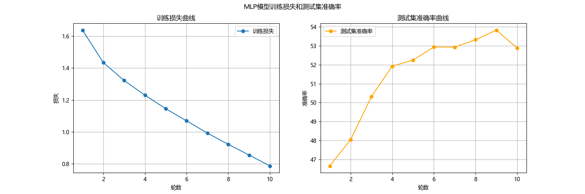  

### 2.实验目的   
对任务三中的MLP模型进行优化迭代，得到一个相对最优的模型。  

### 3.实验记录及分析  

**第一次修改：**  
加入Mixup数据增强：加入mixup_data和mixup_criterion函数。在训练循环中，调用mixup_data函数对输入数据进行混合增强，调用mixup_criterion函数计算损失。  
加入学习率预热Warmup：每轮增加0.0005，最终学习率为0.001。第1-2轮学习率0.0005，后面都为0.001，训练10轮。  
**运行结果：** 参数量：1.7073 M，计算量：0.0017 G ，测试集准确率53.16%。效果不大。 准确率曲线震荡有点严重。  
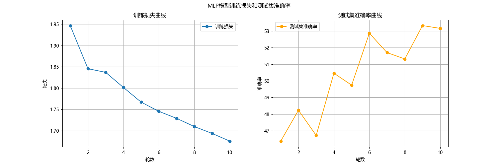 

**第二次修改：**  
调整学习率预热Warmup：  
先线形预热，预热轮数3轮，初始学习率为0.0001，最终学习率为0.001，达到过后开始余弦下降。  
**运行结果：** 参数量：1.7073 M，计算量：0.0017 G，测试集准确率51.98%。反而变为了负面效果。  
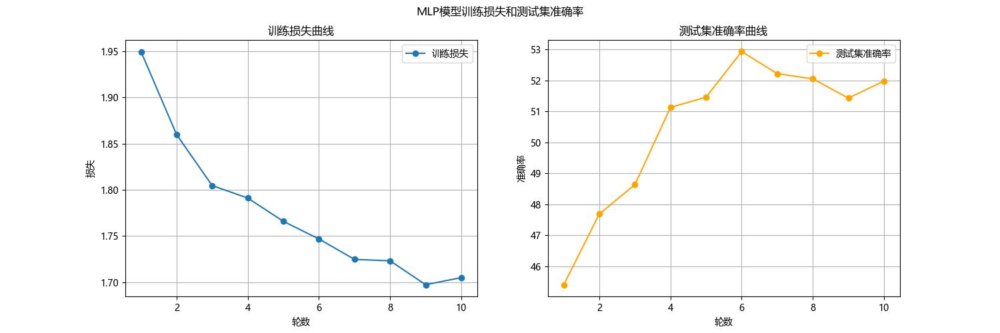  

**第三次修改：**  
把模型简化，将隐藏层维度降低，加入Dropout正则化。  
将隐藏层维度降低可以减少参数量，计算量也会降低。Dropout层在训练时随机暂时关闭一部分神经元的输出，使网络被迫去学习到更分散鲁棒的特征。  
- Dropout层：防止神经网络过拟合的正则化技术。在训练过程中，随机“丢弃”，暂时关闭部分神经元，使其暂时不参与当前批次数据的前向传播和反向传播。在模型测试或者模型推理过程中，被暂时关闭的神经元重新激活，参与正常工作。  
  
**运行结果：** 参数量：0.8209M， 计算量：0.0008G 测试集准确率：50.42%。参数量减少，计算量下降了一半，但是准确率下降了1%。准确率曲线几乎无震荡。 
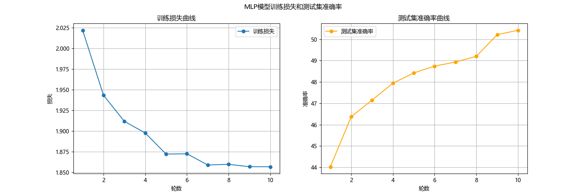   

**第四次修改：**  
增大学习轮数到20轮，3轮预热，17轮退火。  
**运行结果：** 参数量：0.8209M，计算量：0.0008G，测试集准确率：55.75%。准确率显著上升。  
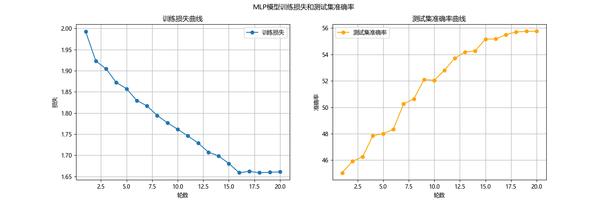  

**第五次修改：**  
继续增加学习轮数，到40轮，5轮预热，35轮退火，最终学习率提高到5e-4。  
**运行结果：** 参数量：0.8209，计算量： 0.0008G，测试集准确率：56.51%。  
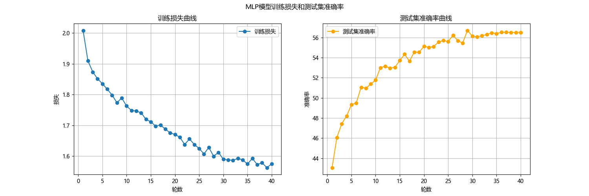  

**第六次修改：**  
这次加入自监督学习预训练，然后在CIFAR10上进行监督微调。  
自监督学习：一种无需人工标注的高效学习范式，让模型从数据本身自动生成监督信号（伪标签），通过解决前置任务来学习数据的通用特征。这些通用特征可以迁移到下游任务中，大幅度降低对标注数据的依赖。  
这里预训练阶段采用旋转预测，监督微调阶段采用交叉熵损失。  
原理：对同一张图片进行旋转等数据增强，得到两个“正样本”，再和其他图像的增强版本（负样本）进行对比，让模型学习正样本对的特征更加相似，负样本对的特征更疏远。  
**运行结果：** 参数量：0.8209M，计算量：0.0008G，测试集准确率：56.99%   
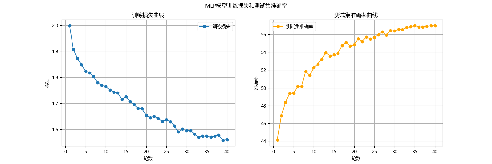 

**第七次修改：**
增加MLP隐藏层层数，提高自监督学习轮数和监督微调总轮数，把Dropout比例从0.3提高到0.5,增强正则化。  
**运行结果：** 参数量：3.6767M ，计算量： 0.0037G，测试集准确率：58.45%。参数量大大增加，训练时长惊人，但是效果甚微。
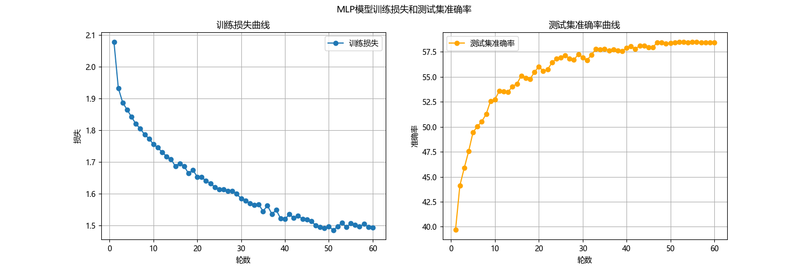  

**第八次修改：**  
降低正则化度，从0.5降到0.4。  
因为根据前几次的准确率曲线，在最后会出现准确率连续多轮未有提高，所以加入早停机制，准确率连续5轮不提高就停止训练。  
改用优化器，从Adam换到AdamW。AdamW和Adam主要是在对权重衰减的处理方式上不同。传统的Adam将权重衰减和梯度更新耦合在一起，有时候就会降低其正则化效果。AdamW则是将权重衰减从梯度更新中解耦，带来更好的泛化性能，帮助模型达到更高的准确率。  
**运行结果：** 参数量：3.6767M，计算量：0.0037G，测试集准确率：55.26%。
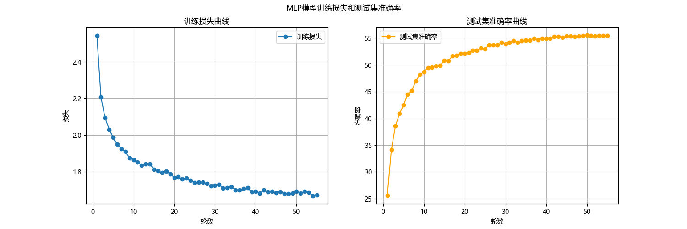    

**第九次修改：**  
继续数据增强，加入随机裁切和随机水平翻转。  
采取批归一化，对每一批的数据进行归一化，显著稳定和加速训练过程。  
计算损失函数时候，引入标签平滑，“软化”真实标签，防止模型对训练数据产生过拟合，提高模型在测试集上的泛化能力  
在数据增强中加入随机擦除，随机在输入图像上擦除一小块区域，使模型关注物体全局特征，提升模型鲁棒性  
**运行结果：** 参数量：3.6798M，计算量：0.0037G，测试集准确率：50.39%。
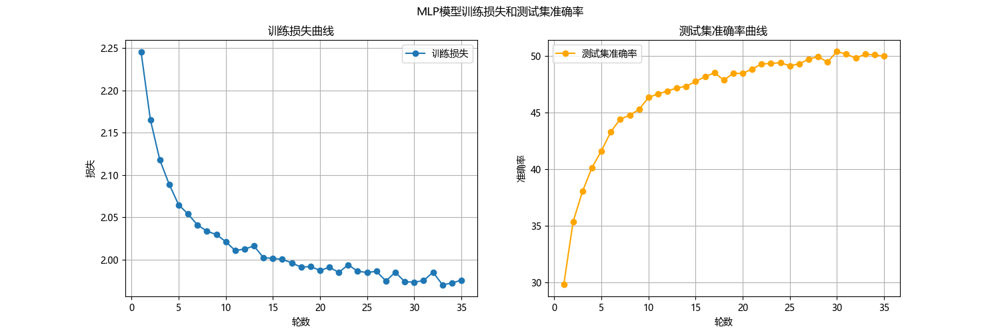   

**第十次修改：**    
加入残差链接，构建更深的网络，也可以避免梯度消失的问题。
**运行结果：** 参数量：73.5253M，计算量：0.0736G，测试集准确率：51.66%。
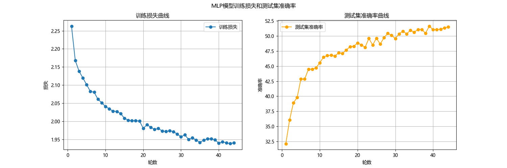  
  
---
#### 对前十次修改及造成的影响的分析：  
**第一次：**  
加入MixUp数据增强，混合输入和标签，提高模型的泛化能力。但是因为此MLP模型比较简单，所以效果不是很显著。  
加入学习率预热，因为训练轮数太少，学习率动态调整没有完全发挥作用，效果不佳，而且准确率曲线震荡严重。  
**第二次：**  
学习率先线形预热，再余弦下降。这种调整方式更适合深层网络，对浅层网络MLP，在预热阶段，低学习率限制了模型初期收敛速度，而余弦下降又过早降低了学习率，导致模型出现欠拟合的情况。  
**第三次：**  
降低隐藏层维度使得模型的拟合能力下降，而且加入Dropout正则化进行过拟合的抑制，加剧了模型的欠拟合问题。但是准确率曲线变得更加平滑，说明过拟合有被抑制。  
**第四次：**  
增加模型训练轮数，从10轮到20轮，调整学习率预热。增加训练轮数使模型有更多的机会学习到数据的特征，提高了模型的泛化能力，加上学习率预热的适当调整，模型准确率得到明显提升。  
**第五次：**  
继续增加训练轮数，调整学习率预热。使得模型在训练后期仍有足够的优化动力，避免模型过早收敛到局部最优解。但是准确率提升不显著，说明仍有问题（可能是模型过拟合，或当下模型架构的性能瓶颈）。  
**第六次：**  
加入自监督学习预训练。使模型在CIFAR10上学习到通用特征，然后在监督微调阶段，模型可以更快地收敛到最优解，提高了模型的准确率。但是浅层MLP网络不能有效利用到自监督学习学到的复杂特征，所以准确率提升有限。  
**第七次：**  
增加隐藏层层数，Dropout比例增加。模型表达能力增加，过拟合被进一步抑制。但是参数数量暴增，训练时间延长，训练成本提高，但是准确率提升不明显。  
**第八次：**    
加入了早停机制，模型可能在还未完全收敛时就提起终止训练。Dropout比例降低，正则化效果减弱，模型过拟合风险增加。两者使得准确率下降。  
**第九次：**  
加入图片随机裁剪，旋转的数据增强手段。批归一化、标签平滑和随机擦除。两者使模型泛化能力增强，但是对深层MLP的根本问题没有改善，准确率反而下降。  
**第十次：**  
加入残差连接，模型网络变得更深，网络深度急剧增加，训练时长暴涨，模型复杂程度远超分类任务需求。出现严重过拟合问题和优化问题。
  
**总结：**  
起正面效果修改：  
- 增加训练轮数，隐藏层层数。  
- Mixup数据增强。  
- 加入自监督预训练。  

起负面效果修改：  
- 学习率预热、余弦退火。  
- 降低隐藏层维度、Dropout比例。  
- 引入批归一化，标签平滑，随机擦除。  
- 改用优化器AdamW。  
- 加入残差连接构建更深的网络。  

---  

**第十一次修改：**  
去除起负面效果的修改：  
- 学习率预热、余弦退火。    
- 引入批归一化，标签平滑，随机擦除。  
- 放弃优化器AdamW，改用优化器Adam。  
- 加入残差连接构建更深的网络。  

**运行结果：** 参数量：8.9216M，计算量：0.0089G，测试集准确率：47.46%。  
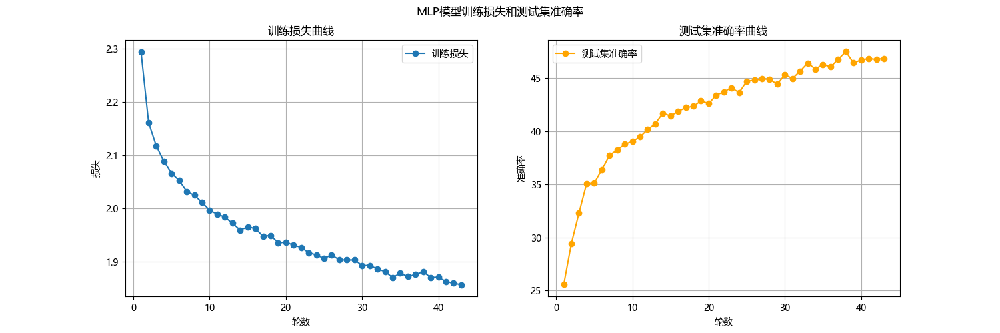    
  
**第十二次修改：**  
调整MLP模型，从3072-2048-1024-512-256改为3072-1024-512-256，模型参数量下降，训练速度会上升，过拟合风险下降。学习率提高到3e-4。  
**运行结果：** 参数量：1.7389M，计算量：0.0017G，测试集准确率：47.59%。准确率曲线震荡严重。  
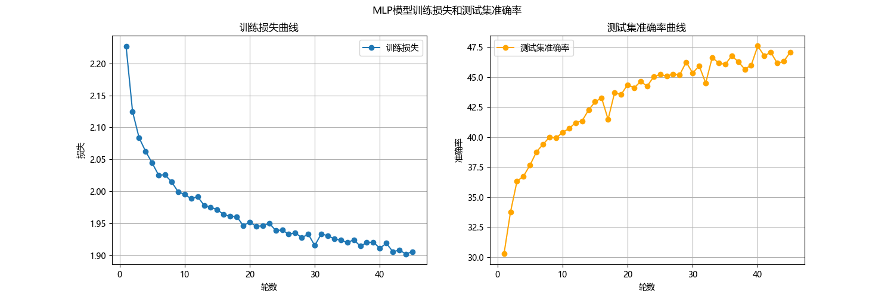    

**第十三次修改：**    
以任务三MLP模型为基础，重写模型，重新进行调整。  
- 采用输入压缩，原本是直接将CIFAR10的3*32*32的图片展平，现在先用一个1*1的卷积核将输入维度降到2维，再展平。这样保留了图像的空间信息，同时减少了参数数量。  
```Python
self.input_compress = nn.Sequential(
    nn.Conv2d(3, 2, kernel_size=1, stride=1, padding=0),  # 3→2通道，比3→1更保留信息
    nn.BatchNorm2d(2),
    nn.LeakyReLU(negative_slope=0.1, inplace=True)
```  
- 加入残差连接，使模型更深，表达能力更强，也避免了梯度消失问题。
- 加入批归一化，BN层，加速模型收敛
- 将Dropout正则化比例从0.5降低到0.2，在防止过拟合的同时，不会丢失过多的信息。
- 换用激活函数，从ReLU改为LeakyReLU，避免死亡ReLU问题。
  - 死亡ReLu问题，指输入小于等于0时，输出为0，导致梯度也为0，模型参数无法更新。

- 继续采用数据增强，随机水平翻转、裁切，标签混合。 
```Python
transforms.RandomCrop(32, padding=4), 
transforms.RandomHorizontalFlip(p=0.5),

for inputs, labels in loader:
    inputs, labels = inputs.to(device), labels.to(device)
    #Mixup数据增强
    inputs, y_a, y_b, lam = mixup_data(inputs, labels, mixup_alpha, device.type=="cuda")
```
- 加入标签平滑。在损失函数中加入，防止模型在训练时对标签过度自信，输出绝对的0或1，导致模型过拟合。
```Python
    #初始化模型
    model = MLP().to(device)
    #损失函数，标签平滑
    criterion = nn.CrossEntropyLoss(label_smoothing=0.05)
```
- 优化器换用为SGD，开启Nesterov动量。  

**运行结果：**
参数量：0.432 M，计算量：0.0004 G，准确率：53.06%，运行时长：9min34s
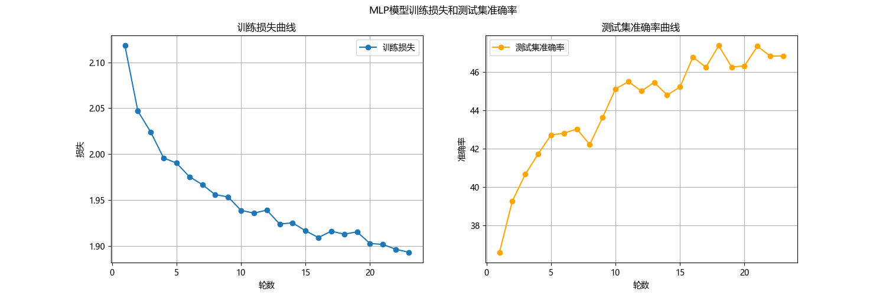    

---
### 4.实验结果总结
  
<table>
  <thead>
    <tr>
      <th>迭代轮次</th>
      <th>核心改进措施</th>
      <th>参数量</th>
      <th>计算量</th>
      <th>测试集准确率</th>
      <th>运行时长</th>
      <th>关键变化</th>
    </tr>
  </thead>
  <tbody>
    <tr>
      <td>原始模型</td>
      <td> —— </td>
      <td>1.7073 M</td>
      <td>0.0017 G</td>
      <td>52.87%</td>
      <td> —— </td>
      <td> —— </td>
    </tr>
    <tr>
      <td>第一次</td>
      <td>加入Mixup数据增强、学习率预热Warmup（0.0005→0.001）；训练10轮</td>
      <td>1.7073 M</td>
      <td>0.0017 G</td>
      <td>53.16%</td>
      <td>—</td>
      <td>准确率略有提升，但是震荡严重</td>
    </tr>
    <tr>
      <td>第二次</td>
      <td>调整学习率预热为线性预热（0.0001→0.001）、到达后余弦退火下降</td>
      <td>1.7073 M</td>
      <td>0.0017 G</td>
      <td>51.98%</td>
      <td>—</td>
      <td>出现负面效果，准确率下降</td>
    </tr>
    <tr>
      <td>第三次</td>
      <td>降低模型隐藏层维度；加入Dropout正则化</td>
      <td>0.8289 M</td>
      <td>0.00086 G</td>
      <td>50.42%</td>
      <td>—</td>
      <td>参数量减半，准确率微降，准确率曲线更平滑</td>
    </tr>
    <tr>
      <td>第四次</td>
      <td>增大训练轮次到20轮，其中3轮预热，17轮退火</td>
      <td>0.8289 M</td>
      <td>0.00086 G</td>
      <td>55.75%</td>
      <td>—</td>
      <td>准确率显著上升</td>
    </tr>
    <tr>
      <td>第五次</td>
      <td>继续增加训练轮次到40轮，5轮预热，35轮退火，学习率提高到5e-4</td>
      <td>0.8289 M</td>
      <td>0.00086 G</td>
      <td>56.51%</td>
      <td>—</td>
      <td>准确率继续提升</td>
    </tr>
    <tr>
      <td>第六次</td>
      <td>加入自监督学习预训练，再在CIFAR10上自监督微调</td>
      <td>0.8289 M</td>
      <td>0.00086 G</td>
      <td>56.99%</td>
      <td>—</td>
      <td>准确率小幅提升</td>
    </tr>
    <tr>
      <td>第七次</td>
      <td>增加MPN隐藏层数量；提高自监督轮数和微调总轮数；Dropout比例从0.3调至0.5</td>
      <td>3.6767 M</td>
      <td>0.0037 G</td>
      <td>58.45%</td>
      <td>—</td>
      <td>参数量大增，效果甚微</td>
    </tr>
    <tr>
      <td>第八次</td>
      <td>降低正则化强度（Dropout比例从0.5调至0.4）；加入早停机制；改用AdamW优化器</td>
      <td>3.6767 M</td>
      <td>0.0037 G</td>
      <td>55.26%</td>
      <td>—</td>
      <td>准确率下降</td>
    </tr>
    <tr>
      <td>第九次</td>
      <td>加入随机裁切、随机水平翻转，进行批归一化，标签平滑，随机擦除</td>
      <td>3.6798 M</td>
      <td>0.0037 G</td>
      <td>58.39%</td>
      <td>—</td>
      <td>准确率回升</td>
    </tr>
    <tr>
      <td>第十次</td>
      <td>加入残差连接，构建更深网络</td>
      <td>73.5253 M</td>
      <td>0.07366 G</td>
      <td>51.66%</td>
      <td>—</td>
      <td>模型过深，准确率骤降</td>
    </tr>
    <tr>
      <td>第十一次</td>
      <td>去除负面效果的修改：学习率预热、余弦退火、批归一化、标签平滑、随机擦除、改用Adam优化器、加入残差连接</td>
      <td>8.9216 M</td>
      <td>0.0089 G</td>
      <td>47.46%</td>
      <td>—</td>
      <td>准确率继续下降</td>
    </tr>
    <tr>
      <td>第十二次</td>
      <td>调整MLP模型（从3072-2048-1024-512-256 到 3072-1024-512-256），学习率提高到3e-4</td>
      <td>1.7389 M</td>
      <td>0.0017 G</td>
      <td>47.59%</td>
      <td>—</td>
      <td>参数量下降，准确率震荡严重</td>
    </tr>
    <tr>
      <td>第十三次</td>
      <td>1×1卷积降维压缩输入，加入残差连接，进行批归一化，Dropout比例降到0.2，改用LeakyReLU激活函数，加入数据增强（水平翻转、裁切、标签混合），标签平滑，优化器换为带Nesterov动量的SGD</td>
      <td>0.432 M</td>
      <td>0.0004 G</td>
      <td>53.06%</td>
      <td>9min34s</td>
      <td>参数量计算量显著降低，准确率回升</td>
    </tr>
  </tbody>
</table>    

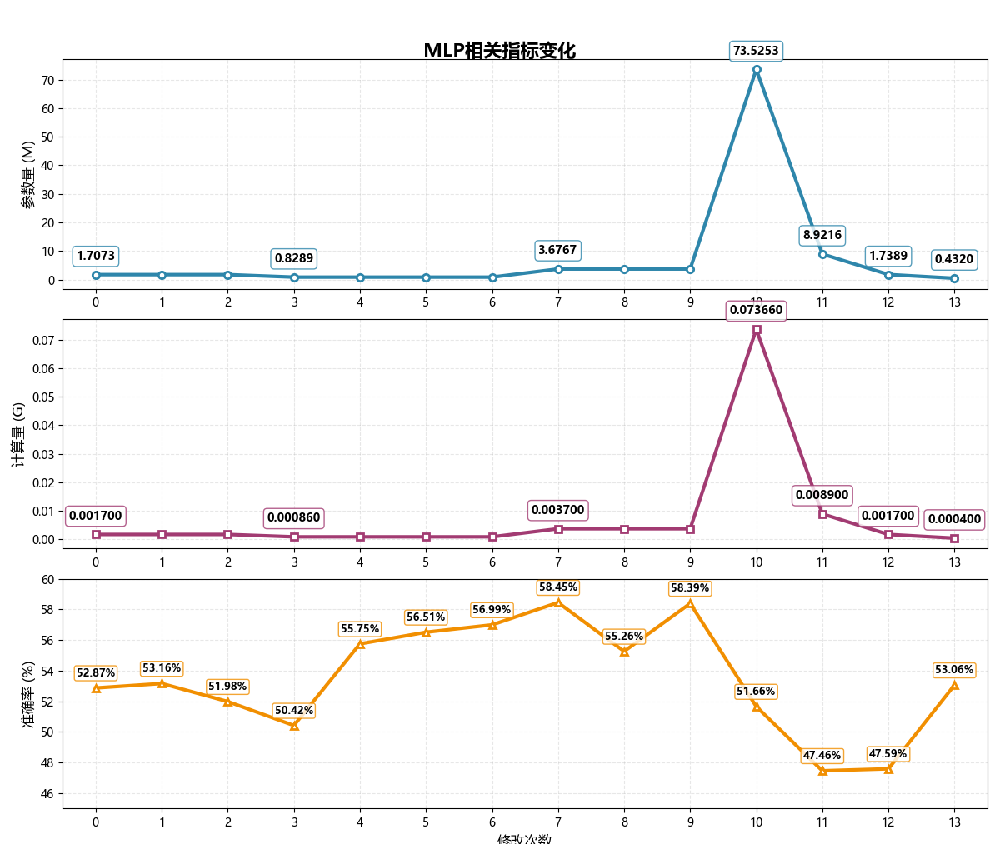
  
**总结：**  
最终的模型为第十三次修改后的版本。  
虽然相比于任务三中的VGG13模型，准确率几乎没变化，但是参数量和计算量得到显著减少，模型得到极大地轻量化。  
>模型代码为：task4_MLP.py
---
## 四. VGG13 模型优化迭代实验  
### 1.背景  
在任务三中，我搭建了一个VGG13模型对CIFAR-10数据集进行图像分类任务。  
截止到2.2.15.47，模型的准确率达到了**85.81%**。  
>任务三中VGG模型源代码为：task3_VGG.py  

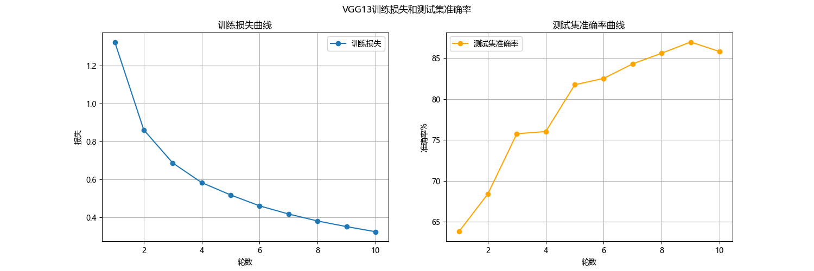  
### 2.实验目的  
对实验三的模型进行优化迭代实验，得到一个相对最优的模型。  

### 3.实验记录及分析
  
**注意：**  
优化前最后一次运行结果：  
参数量：9.42 M，计算量：0.23 G，测试集准确率：84.18%。  
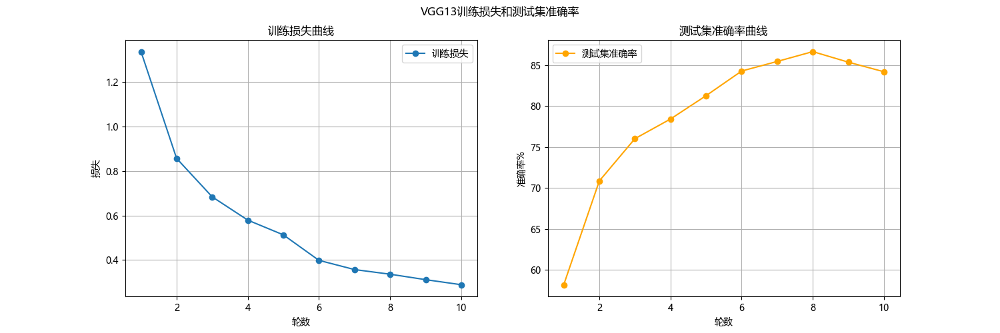  
  
**第一次修改：**  
加入Mixup数据增强，随机水平翻转、裁切，标签混合。   
```Python 
transforms.RandomCrop(32, padding=4),  #随机裁切
transforms.RandomHorizontalFlip(),     #随机水平翻转

inputs, y_a, y_b, lam = mixup_data(inputs, labels, alpha=1.0)  #图片及其标签混合生成新的训练样本
``` 
加入Dropout正则化，p = 0.5。  
加入早停机制，连续3轮学习率无提升就停止训练。  
```Python
#加入早停机制
    #参数
    patience = 3
    best_accuracy = 0.0
    epochs_no_improve = 0
    best_model_state = None

#早停机制判断
      if epoch_accuracy > best_accuracy:
          best_accuracy = epoch_accuracy
          epochs_no_improve = 0
          best_model_state = VGG13.state_dict()  #保存当前最优模型参数
      else:
          epochs_no_improve += 1
          if epochs_no_improve >= patience:
              print(f'连续 {patience} 轮没有提升，早停训练。')
              break
```
在卷积层后加入BN层，进行批归一化，提高模型的收敛速度和泛化能力。  
```Python
#深度卷积 Depthwise Convolution
nn.Conv2d(in_channels, in_channels, kernel_size=3, padding=1, groups=in_channels, bias=False),
nn.BatchNorm2d(in_channels),  #BN层，对每个通道进行归一化
nn.ReLU(inplace=True),
#逐点卷积 Pointwise Convolution
nn.Conv2d(in_channels, out_channels, kernel_size=1, bias=False),
nn.BatchNorm2d(out_channels),
nn.ReLU(inplace=True)
```
增加训练轮数到20轮。  

**运行结果：**   
参数量：9.68 M，计算量：0.23 G，测试集准确率: 87.61%,运行时长：7min10s。  

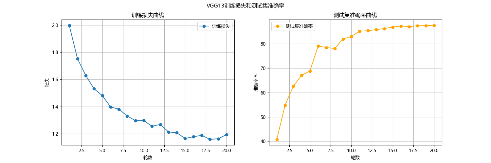    
**分析：**  
- 三个数据增强措施的组合，使得训练数据分布得到扩- 充，模型的泛化能力得到提高。  
- Dropout正则化，随机丢弃50%神经元，神经元之间的共时性被打破，使得模型不会过度依赖局部特征，泛化能力得到增强，同时起到过拟合作用。  
- 早停机制，连续3轮学习率无提升就停止训练，在验证集性能下降前就提前结束训练，避免过拟合。  
相比于原始模型增加了训练轮数，模型能更多地学习数据特征。  
- 最终导致准确率得到提升，尽管提升不大。
  
**第二次修改：**  
调整卷积核尺寸，从3 * 3改为1 * 1 + 3 * 3，减少计算量，保持相同的感受野。  
- 先加入瓶颈层，1*1的卷积层将输入通道数减少到瓶颈通道数。
- 后空间卷积，用一个3*3的卷积层保持输出特征图尺寸不变,且将通道数恢复到原始输出维度。      
  
**运行结果：**  
参数量：3.28 M，计算量：0.09 G，测试集准确率: 84.03%,运行时长：7min17s。    
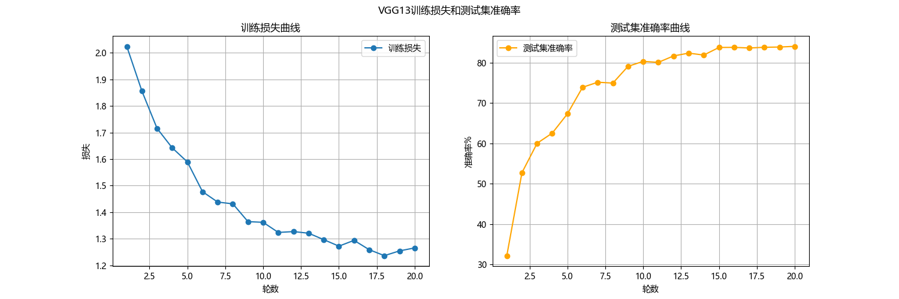  
**分析：**  
- 1 * 1卷积核，瓶颈层将通道降维。在通道降为后，3 * 3卷积的参数量和计算量将会巨量减少。  
- 通道降为过程中，数据部分特征信息丢失，以及模拟综合数据的能力减弱，导致准确率略微下降。


**第三次修改：**  
全局平均池化（GAP）替代全连接层：去掉最后的三层全连接，用nn.AdaptiveAvgPool2d将卷积输出直接映射为类别数。    
```Python
super(VGG, self).__init__()
self.features = self._make_layers(cfg[vgg_name])
self.avgpool = nn.AdaptiveAvgPool2d((1, 1))  #全局平均池化
```
**运行结果：**   
参数量：3.28 M，计算量：0.09 G，测试集准确率: 84.63%,运行时长：13min21s。   
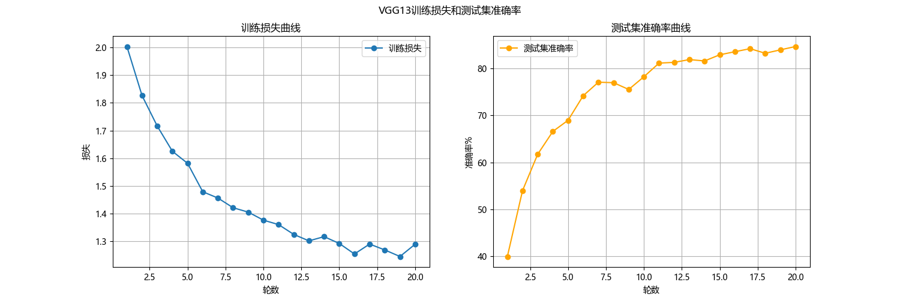  
**分析：**  
- 运行时长几乎翻倍（7min17s-->13min21s），但是准确率几乎没有提升。原因为，全局平均池化需要对每个特征图的每个通道做全局平均计算，但是之前的全连接层是矩阵乘法。训练时，全局平均池化计算效率更低，导致计算时长激增。
- 全局平均池化提升了模型的泛化能力，降低了过拟合风险。
 
**第四次修改：**  
去掉瓶颈式卷积结构，只保留3*3卷积层。  
在全局平均池化之后保留一个全连接层Linear来进行最终分类。  
**运行结果：**  
参数量：9.68 M，计算量：0.23 G，测试集准确率: 88.42%,运行时长：7min10s。  
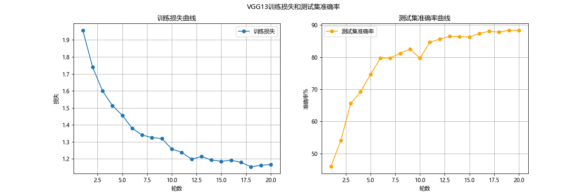  
**分析：**  
- 去掉瓶颈结构，回到3*3卷积，模型能够学到更丰富的空间特征，感受野更大，准确率增加到极值。  
- 不再进行瓶颈结构的额外计算，全连接层被保留一个，运行时长降低。   

**第五次修改：**  
用深度可分离卷积将标准卷积分为深度卷积(depthwise)和逐点卷积(pointwise)，将卷积层轻量化，减少计算量和参数量。  
将VGG13中重复的如 2个3*3卷积+ReLU模块 替换为 1个深度卷积+1个逐点卷积+BN+ReLU模块。  
```Python
#深度卷积 Depthwise Convolution
nn.Conv2d(in_channels, in_channels, kernel_size=3, padding=1, groups=in_channels, bias=False),
nn.BatchNorm2d(in_channels),
nn.ReLU(inplace=True),
#逐点卷积 Pointwise Convolution
nn.Conv2d(in_channels, out_channels, kernel_size=1, bias=False),
nn.BatchNorm2d(out_channels),
nn.ReLU(inplace=True)
```
在卷积组后添加Squeeze-and-Excitation模块，通过全局池化学习通道权重，自适应增强重要特征，提升模型准确率。  
```Python
#定义squeeze-and-excitation模块
class SELayer(nn.Module):
    def __init__(self, channel, reduction=16):
        super(SELayer,self).__init__()
        self.avg_pool = nn.AdaptiveAvgPool2d(1)
        self.fc = nn.Sequential(
            nn.Linear(channel,channel // reduction, bias=False),
            nn.ReLU(inplace=True),
            nn.Linear(channel // reduction, channel, bias=False),
            nn.Sigmoid()
        )

    def forward(self, x):
        b, c, _, _ = x.size()
        y = self.avg_pool(x).view(b, c)
        y = self.fc(y).view(b, c, 1, 1)
        return x * y.expand_as(x)

#把SE模块放到深度可分离卷积后，让通道注意力更精细
layers.append(SELayer(out_channels))
in_channels = out_channels
```
**第一次运行结果：**  
 参数量：1.16 M，计算量：0.03 G，测试集准确率: 80.87%,运行时长：7min29s.  
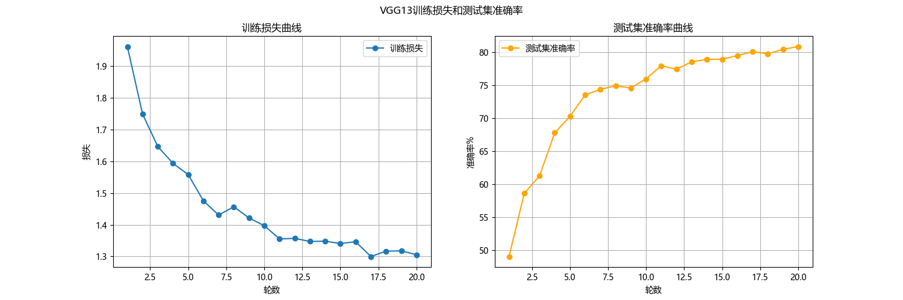

**第二次运行结果：**  
 参数量：1.16 M，计算量：0.03 G，测试集准确率: 78.92%,运行时长：22min49s  
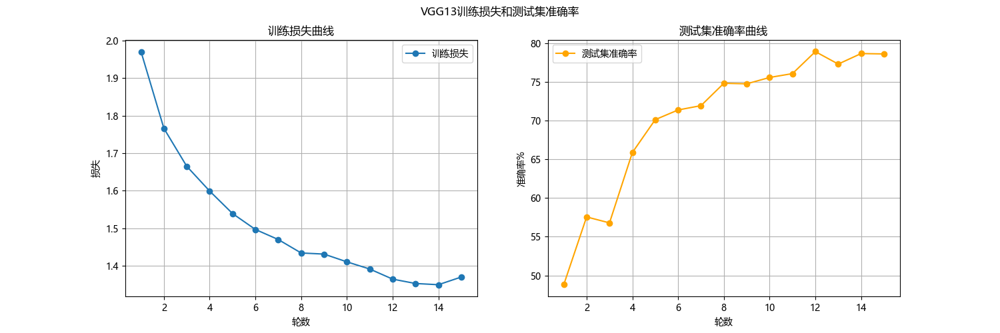

**分析：**     
- 深度可分离卷积把通道卷积和空间卷积的组合拆分。参数量原本的 *输出通道×输入通道×3×3* 下降到 *输入通道×3×3 + 输出通道×输入通道×1×1*，参数量和计算量都巨量减少。  
- 两次运行准确率的剧烈变化大概原因为：
  - 第一次：SE注意力板块自适应调整了通道权重，偏向于数据重要特征，恰好弥补了深度可分离卷积的特征提取不足。并且可能数据分布刚好达到最佳效果。
  - 第二次：深度可分离卷积的模型容量达到极低，模型各方面的变化对其影响大，模型稳定性差。  
- 可能原因为，模型第二次运行时候，出现梯度震荡，计算效率效率降低，导致运行时间剧增。 

**第六次修改：**   
将SE模块放到深度可分离卷积后，让通道注意力更精细。  
将StepLR学习率调度换掉，加入余弦退火学习率，让模型在后期更稳定收敛。  
```Python
main_scheduler = optim.lr_scheduler.CosineAnnealingLR(optimizer, T_max=EPOCH - warmup_epochs)
```  
**运行结果：**   
参数量：1.24 M，计算量：0.03 G，测试集准确率: 81.66%,运行时长：7min58s.    
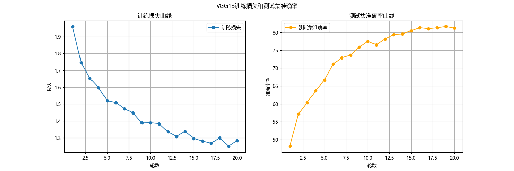  

**分析：**  
- 可分离卷积层输出的特征图进入SE模块，SE模块对其重要特征进行加权，增强关键特征、抑制无关特征，提升模型的识别精度。准确率得以上升。
- 将StepLR替换为余弦退火学习率，模型在后期更稳定收敛，准确率也有提升。

**第七次修改：**  
加入Warnup学习率预热，前5轮进行预热,学习率预热到0.1，再进行余弦退火。  
优化器从Adm更换到SGD
```Python
#设置预热参数
    warmup_epochs = 5
    num_epochs = 20
    #创建带有预热的学习率调度器
    #主调度器
    main_scheduler = CosineAnnealingLR(optimizer, T_max = num_epochs - warmup_epochs)
    #预热调度器
    warmup_scheduler = LinearLR(optimizer, start_factor=0.1, total_iters=warmup_epochs)
    #组合调度器
    scheduler = SequentialLR(optimizer, schedulers=[warmup_scheduler, main_scheduler], milestones=[warmup_epochs])
```  
在classifier中加入一个512*512的隐藏层和一个ReLU激活函数，增强正则化。  
**运行结果：**  
 参数量：1.5 M，计算量：0.03 G，测试集准确率: 86.92%,运行时长：7min58s.    
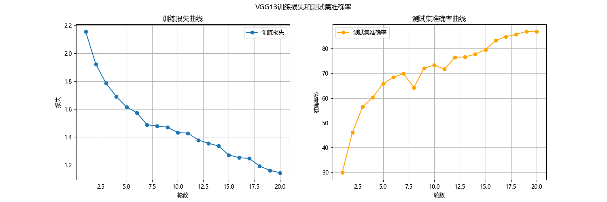  
**分析：**  
- 加入Warmup学习率预热，和余弦退火形成组合。初始阶段学习率慢慢增加，避免学习率过大造成梯度爆炸，后期学习率缓慢下降，避免学习率过小造成模型收敛缓慢，准确率有提升。
- SGD泛化能力比Adam更强，切换后提升防过拟合能力。  
- 隐藏层增加，但未过度增加参数量。模型的容量得到提升，弥补了深度可分离卷积的特征提取不足。


---
### 4.实验结果总结

<table class="vgg-table">
  <thead>
    <tr>
      <th>迭代轮次</th>
      <th>核心改进措施</th>
      <th>参数量</th>
      <th>计算量</th>
      <th>测试准确率</th>
      <th>运行时长</th>
      <th>关键变化</th>
    </tr>
  </thead>
  <tbody>
    <tr>
      <td>原始模型</td>
      <td> —— </td>
      <td>9.42 M</td>
      <td>0.23 G</td>
      <td>84.18%</td>
      <td> —— </td>
      <td> —— </td>
    </tr>
    <tr>
      <td>第一次</td>
      <td>加入Mixup数据增强、Dropout正则化、早停机制、增加运行轮次</td>
      <td>9.68 M</td>
      <td>0.23 G</td>
      <td>87.61%</td>
      <td>7min18s</td>
      <td>准确率显著提升，参数量略增</td>
    </tr>
    <tr>
      <td>第二次</td>
      <td>进行1×1卷积降维、3×3卷积恢复维度、加入批归一化</td>
      <td>3.28 M</td>
      <td>0.09 G</td>
      <td>84.03%</td>
      <td>7min17s</td>
      <td>参数量和计算量大幅下降，准确率略降</td>
    </tr>
    <tr>
      <td>第三次</td>
      <td>用全局平均池化替代全连接层</td>
      <td>3.28 M</td>
      <td>0.09 G</td>
      <td>84.63%</td>
      <td>15min21s</td>
      <td>准确率略有回升，但运行时长翻倍</td>
    </tr>
    <tr>
      <td>第四次</td>
      <td>去除瓶颈式结构，恢复3×3卷积核</td>
      <td>9.68 M</td>
      <td>0.23 G</td>
      <td class="highlight">88.42%</td>
      <td>7min18s</td>
      <td>准确率达到最值，参数量和计算量重回极值</td>
    </tr>
    <tr>
      <td>第五次</td>
      <td>加入深度可分离卷积、SE注意力</td>
      <td>1.16 M</td>
      <td>0.03 G</td>
      <td>88.87% / 78.92%</td>
      <td>7min29s / 22min49s</td>
      <td>模型轻量化达到极致，两次运行准确率和时间波动大</td>
    </tr>
    <tr>
      <td>第六次</td>
      <td>将SE模块后移，换用StepLR学习率调度</td>
      <td>1.24 M</td>
      <td>0.03 G</td>
      <td>81.66%</td>
      <td>7min58s</td>
      <td>准确率下降，轻量化保持</td>
    </tr>
    <tr>
      <td>第七次</td>
      <td>加入Warmup学习率预热、优化器换用SGD、增加隐藏层</td>
      <td>1.5 M</td>
      <td>0.03 G</td>
      <td>86.92%</td>
      <td>7min58s</td>
      <td>准确率回升，轻量化保持</td>
    </tr>
  </tbody>
</table>

**准确率、参数量和计算量变化图：**    
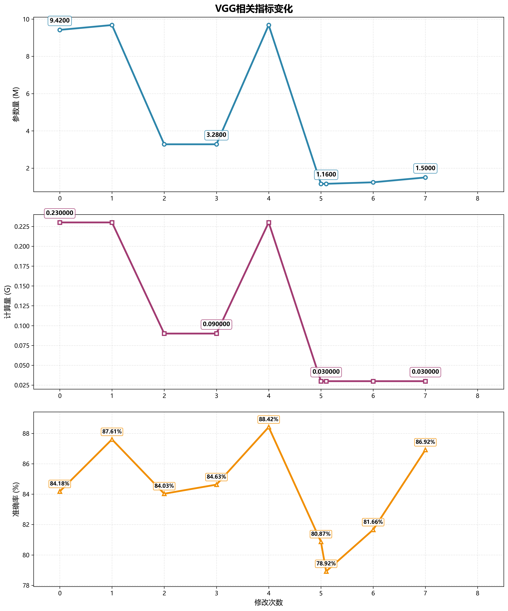 
 
最好的模型为第七次修改后的版本。  
>源代码：task4_VGG.py  

深度可分离卷积+SE注意力+Warmup学习率预热+SGD优化器+少量隐藏层组合应该是相对的最优解。  
虽然准确率略比准确率极值更低一点，但是参数量和计算量大幅度下降，模型得到了极好的轻量化。  
